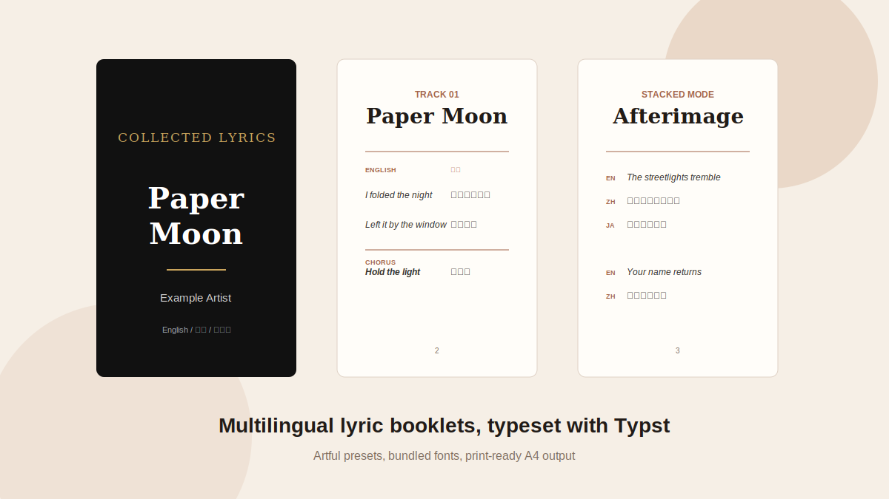

# Lyrics Booklet

[English README](README.md)

`lyrics-booklet` 用结构化歌词数据生成适合打印的 A4 歌词册 PDF。它适合专辑歌词内页、中英/多语言对照歌词、翻译合集、听歌会资料、同人歌词本和小型 zine。



## 特性

- 支持中文、日文、韩文、英文和西语
- 可自定义语言顺序、语言标签、字体、字号和列宽
- 内置字体：Inter、Inter Italic、Playfair Display、Space Grotesk、Noto Sans SC/TC/JP/KR
- 四套视觉预设：`gallery`、`minimal`、`noir`、`zine`
- 两种正文排版：多列对照或多语言堆叠
- 可导出 Typst 源文件，方便继续精修
- 默认 A4 打印尺寸，并保留装订友好的页边距
- 兼容旧版中英 tuple 数据格式

## 快速开始

```bash
python -m pip install typst
python scripts/generate_booklet.py examples/cjk_spanish_data.py \
  --preset gallery \
  --languages en,zh,ja,ko,es \
  --line-layout stacked \
  --output lyrics-booklet.pdf
```

只生成 Typst 源文件、不编译 PDF：

```bash
python scripts/generate_booklet.py examples/cjk_spanish_data.py \
  --preset noir \
  --typst-out lyrics-booklet.typ \
  --no-pdf
```

## 支持语言

脚本不是把语言写死，而是读取 `LANGUAGES` 里的 key 和字体。当前默认和内置字体重点覆盖：

| 语言范围 | 常用 key | 默认字体 |
| --- | --- | --- |
| 英文 | `en` | Inter |
| 西语 | `es` | Inter |
| 简体中文 | `zh`, `zh-cn`, `zh-hans` | Noto Sans SC |
| 繁体中文 | `zh-tw`, `zh-hant` | Noto Sans TC |
| 日文 | `ja` | Noto Sans JP |
| 韩文 | `ko` | Noto Sans KR |

其他语言也可以使用，只要在 `LANGUAGES` 里指定合适字体。

## 数据格式

推荐使用字典格式：

```python
BOOKLET = {
    "album_title": "Paper Moon Sessions",
    "album_subtitle": "中日韩英西语歌词册",
    "artist": "Example Artist",
}

LANGUAGES = [
    {"key": "en", "label": "English", "font": "Inter", "style": "italic"},
    {"key": "zh", "label": "中文", "font": "Noto Sans SC"},
    {"key": "ja", "label": "日本語", "font": "Noto Sans JP"},
    {"key": "ko", "label": "한국어", "font": "Noto Sans KR"},
    {"key": "es", "label": "Español", "font": "Inter"},
]

TRACKS = [
    {
        "number": "01",
        "title": "Paper Moon",
        "sections": [
            {
                "label": "Verse 1",
                "lines": [
                    {
                        "en": "I folded the night",
                        "zh": "我把夜晚折起",
                        "ja": "夜を折りたたむ",
                        "ko": "밤을 접어 두었네",
                        "es": "Doblé la noche",
                    },
                ],
            },
        ],
    },
]
```

完整说明见 `references/lyrics-format.md`。

## 字体

生成器会自动搜索：

1. skill 内部的 `assets/fonts/`
2. 常见系统字体目录，例如 `C:\Windows\Fonts` 和 `/usr/share/fonts`
3. `--font-dir` 额外传入的字体目录

如需重新下载字体：

```bash
python scripts/download_fonts.py --set core
python scripts/download_fonts.py --set core --set cjk
```

字体来源为官方 Google Fonts 仓库，并随仓库保留 OFL 授权文件。

## 视觉预设

| 预设 | 适合场景 |
| --- | --- |
| `gallery` | 精致专辑内页、礼物型歌词册 |
| `minimal` | 黑白激光打印、密集歌词资料 |
| `noir` | 高反差封面、戏剧感专辑包装 |
| `zine` | 独立 demo、同人本、小型 zine |

## 使用提醒

公开发布或商业印刷前，请确认歌词、翻译和字体授权。仓库内置字体来自 Google Fonts，并附带 OFL 授权文件。
